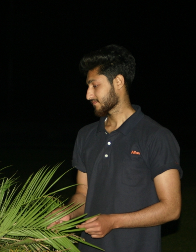

# 👋 Hi, I'm Shahwaiz Zahid

🎓 Software Engineer — graduated from University of the Punjab  
💼 Currently working as a **Back-end Developer** at Softix Technology  
🧠 Passionate about Full Stack Web Development, Mobile Apps, and AI tools

I'm a self-motivated and versatile Software Engineer with hands-on experience in:

- 🔧 Full Stack (MERN) Development
- 📱 Mobile App Development (Flutter, React Native)
- 🤖 Machine Learning (Python, OpenCV, NumPy)
- 🎨 UI/UX Design & Real-Time Systems

Always open to new ideas, team collaboration, and open-source contributions.
